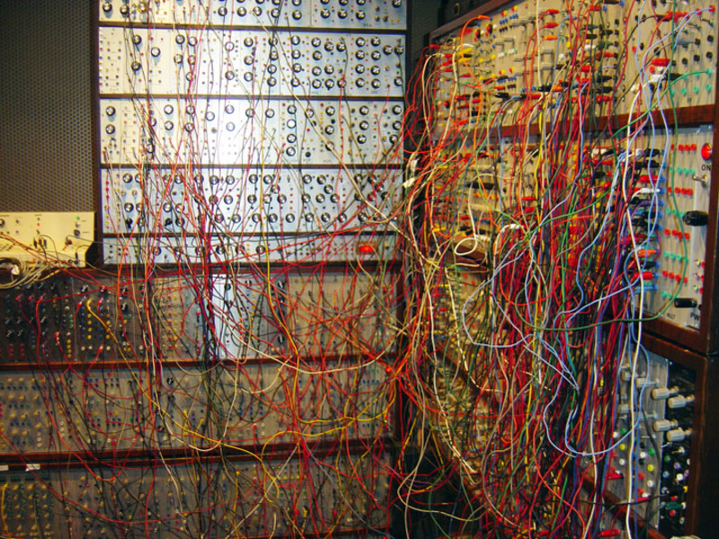
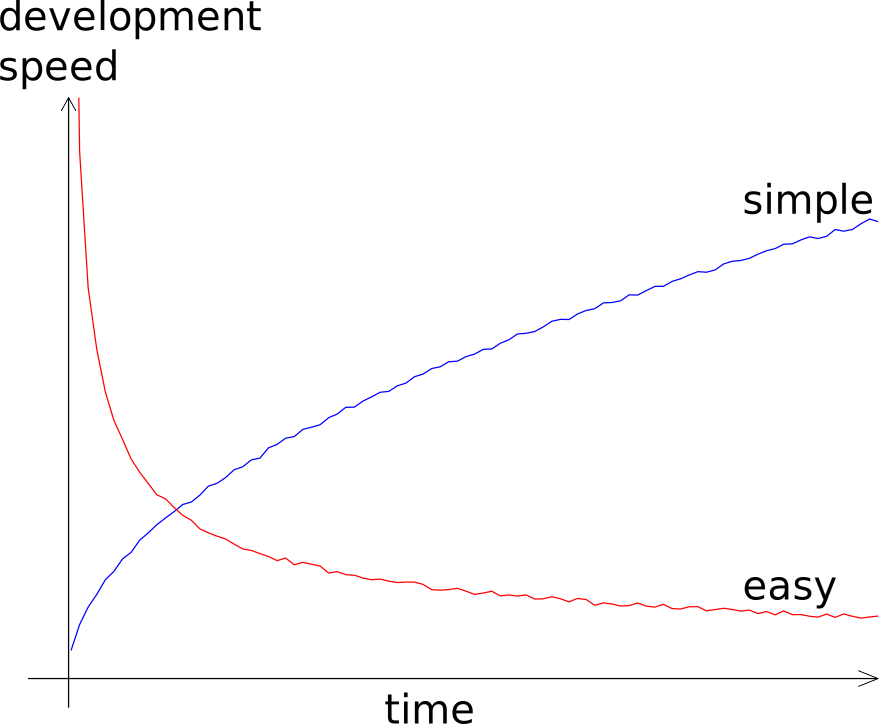

name: inverse
layout: true
class: center, middle, inverse
---
## Solvation Models

.subtitle[Implementation challenges, lessons learnt, best practices]

.author[Marco Caricato]

.institution[The University of Kansas]

.author[Roberto Di Remigio]

.institution[UiT - The Arctic University of Norway]

.footnote[[CC BY 4.0](https://creativecommons.org/licenses/by/4.0/) licensed.
Browse slides at [http://tinyurl.com/continuum-talking-points](http://tinyurl.com/continuum-talking-points)]

---

layout: false

## Software grows complex over time

_"The complexity of software is an essential property, not an accidental one [Fred Brooks](http://worrydream.com/refs/Brooks-NoSilverBullet.pdf)."_


- We start with a simple idea and overtime software grows complex
- It is inherent characteristic of software to change and grow over time
- There is no silver bullet for managing complexity. However, there are some bad practices that we can avoid.

(Slide taken from [Complexity in software development](http://cicero.xyz/v2/remark/github/bast/talk-complexity/master/talk.md) by [Radovan Bast](http://bast.fr) and Harsha Vathsavayi)

---

## The front panel: many dependencies



(c) Joe Paradiso

(Slide taken from [Complexity in software development](http://cicero.xyz/v2/remark/github/bast/talk-complexity/master/talk.md) by [Radovan Bast](http://bast.fr) and Harsha Vathsavayi)

---

## The back side: global variables


(c) Joe Paradiso

(Slide taken from [Complexity in software development](http://cicero.xyz/v2/remark/github/bast/talk-complexity/master/talk.md) by [Radovan Bast](http://bast.fr) and Harsha Vathsavayi)

---

## Simple vs. easy



(Slide taken from [Complexity in software development](http://cicero.xyz/v2/remark/github/bast/talk-complexity/master/talk.md) by [Radovan Bast](http://bast.fr) and Harsha Vathsavayi)

---

## [The tar pit](http://shaffner.us/cs/papers/tarpit.pdf)

- Over time software tends to become harder and harder to reason about
- The code base easily becomes untidy ("I'll fix it later")
- Small changes become harder to implement
- Hacks and workarounds trump design
- Bugs start appearing in unexpected places
- More time is spent debugging than developing
- Complexity strangles development because it does not scale well

(Slide taken from [Complexity in software development](http://cicero.xyz/v2/remark/github/bast/talk-complexity/master/talk.md) by [Radovan Bast](http://bast.fr) and Harsha Vathsavayi)

---
layout: false

## Software Development Is Essential to Quantum Chemistry

- Software architecture must allow fast development of new methods.
- Computer implementations must be reproducible.red[<sup>1</sup>]
- New modelling challenges require new (or improved) methods and new (or
  improved) software implementations.
- Software cannot be rewritten from scratch every time, we need to have
  **extensible** architectures
- Fast-paced development cycles can only occur within a clear software structure
- **Modularity**. Delimit capabilities, concerns, results.
- Reinventing the wheel is bad
- Build small, well-documented software components
- Reuse components in different contexts

.footnote-cite[.red[<sup>1</sup>] Hatton, L.; Warr, G. [arXiv [q-bio.QM]](https://arxiv.org/abs/1608.06897), (2016)]

---
layout: false
class: split-50-50
## Quantum/Classical __Polarizable__ Multiscale Models.red[<sup>1</sup>]

- Use **quantum** and **classical** physics together
  * quantum for chemically relevant subsystem
  * classical **and** polarizable for the environment

.column[
<p style="text-align:center;"></p>
<p style="clear: both;">
]
.column[
<p style="text-align:center;"></p>
<p style="clear: both;">
]
.footnote-cite[.red[<sup>1</sup>] Senn, H. M.; Thiel, W. _Angew. Chem. Int. Ed._ (2009), __48__, 1198]

???

- The idea of multiscale models is to _focus_ on the chemically relevant part
  of the system and treat the environment approximately.

---
layout: false

## Quantum/Classical __Polarizable__ Multiscale Models

- Discrete and continuum are similar
- Solution of a linear system of equations to obtain polarization
`$$
 \color{Green}{\mathbf{A}}\color{Red}{\mathbf{p}} = - \color{Green}{\mathbf{B}}\color{Blue}{\mathbf{s}}
$$`

1. What should be the boundary between classical and quantum software?
  - What should the quantum module take care of?
  - How to ensure extensibility?

1. Can we exploit the similarity?
  - What should the classical module take care of?
  - How should quantum and classical communicate?

2. What is needed to layer different methods for the environment?
  - How should different classical layers communicate?
  - Variational formulations?

3. Performance bottlenecks and how to overcome them.

---
layout: false

## Quantum Layer

1. Integrals
  - Who drives the computation of integrals?
  - Interoperable formats for data transfer of large arrays?
2. SCF procedure
  - Updates of the energy
  - Updates of the Fock matrix
3. Response calculations
  - Formation of the perturbed solvent contributions
  - Iterative solution of the response equations
4. Post-SCF methods:
  - Linear response solvation
  - State-specific solvation
5. Geometric derivatives
  - Numerical vs. analytic  approaches
  - What contributions are needed from the classical layer?
  - Can automatic differentiation be used?

---
layout: false

## Post-SCF Methods: Linear Response (LR) Solvation

- Response methods, e.g. TDDFT, with LR solvation require transition amplitudes
to evaluate a “transition” solvent response.
- In terms of code interface, these methods have similar requirements as the SCF:
  1. Read-in trial vector(s) of transition amplitudes (= density in SCF)
  2. Build solvent contribution and contract on the fly (= contribution to Fock matrix in SCF)
  3. Return contracted array to be added to QM contribution (= add to Fock matrix in SCF)

---
layout: false

## Post-SCF Methods: State-Specific (SS) Solvation

- In SS solvation, the solvent response is equilibrated with a state density
  different than that of the SCF (e.g., CC, excited state, etc.)
- SS solvation requires an external iterative procedure for the solute-solvent
  equilibration that is not required in “in vacuo” calculations.
  1. Who handles the external iteration, the QM module or the solvent module?
  2. The SCF may or may not be part of the external iteration. Is the QM code
     modular enough to handle external iterations only on the post-SCF part?

---
layout: false

## Continuum layer

1. Generating the cavity
  - Reading the geometry
  - Identifying functional groups
  - Discretization
  - Is there an interoperable format to transfer cavity information?

2. Classical solver
  - Environment representations, _i.e._ Green’s functions
  - Operator representations, _i.e._ collocation _vs_ Galerkin _vs_ domain decomposition
  - Linear system solver

3. Geometric derivatives
  - What contributions are needed from the QM layer?
  - Can automatic differentiation be used?

---

template: inverse

## Recommendations

---

## A Checklist of Sorts for Application Programming Interfaces

_In computer programming, an __application programming interface__ (__API__) is
a set of subroutine definitions, protocols, and tools for building software and
applications._

### Encapsulation

- Hide internals by language or by convention
- Interface exposed in a separate file
- Expose the **what**, hide the **how**

### Development history

- Decouple the development history
- Each unit should have its own Git history/repository

.footnote-cite[Source: Wikipedia [Application programming interface](https://en.wikipedia.org/wiki/Application_programming_interface)]

---

## A Checklist of Sorts for Application Programming Interfaces, contd.

### Documentation

- Separate the **what it can do** from **how is it implemented**
- Documented **application programming interface** (API)
- Versioned API ([semantic](http://semver.org) or [sentimental](http://sentimentalversioning.org)
  or [romantic](https://github.com/jashkenas/backbone/issues/2888#issuecomment-29076249) versioning)

### Testing

- You don't want to find a bug in the Alps
- Sharpens interfaces
- Exposes coupling and cohesion

### Building and deploying

- Prerequisite for testable on its own
- Suitable distribution mechanisms

---

## Continuous refinement
- Several drafts are written before submitting a paper
- While developing software, continuous refinement is necessary

## Divide and conquer

- Split the code up
- Construct your program from parts:
  - functions
  - modules
  - packages (Python) or libraries (C or or C++ or Fortran)

---
## Functions, functions, functions

- Build your code from functions
- Break your code down to more functions
  - if you have too many levels of indentation
  - if a function gets too long
  - if a function does more than one thing
  - if you find it hard to name a function
- A function that performs a single operation is simpler to
  understand, test, and reuse
- A function that does not fit on one screen is too long

---

## What about I/O?

- Keep I/O on the outside and connected
- Always read/write on the outside and pass data
- Do not read/write deep down inside the code
- Keep the inside of your code pure/stateless
- Move all the state to the outside of your code
- Keep the stateful outside shell thin


---

## C interface for libraries

- English is to humans what C is to programs
- C is the common language
- Basically any language can talk to a C interface
- **Create a C interface for your code**
- Better than Fortran interface (the latter imposes compilation
  order and introduces compiler dependence)

### Core language

- Core language can be any language that can export a C API
- For single-core high-performance use C or C++ or Fortran
- With an eccentric language you risk to reduce the number of contributors

### Communicate through memory or through files?

- Through memory is more general than through files

---

## Import and export

- Import only the functionality that you need
- Import only where you need it
- Export as little functionality as possible


## Naming things

- Use meaningful names
- Indent
- Use standard naming conventions
- Python: use [PEP8](https://www.python.org/dev/peps/pep-0008/)
- Write comments in English

```
getlnm()     vs     getlastname()
```
---

## Simplicity and clarity before elegance before efficiency

### Avoid premature optimization

- Do not optimize
- If you have to optimize, optimize later
- If you have to optimize, measure, do not guess

### Simple is better than complex

- If you cannot understand or explain a function on a cold gray Monday morning before coffee, it is too complex. (Quote adapted from [Pieter Hintjens, Social Architecture, 2009](https://www.gitbook.com/book/hintjens/social-architecture/details))
---
name: last-page
template: inverse

# Thanks for your attention!

Slideshow created using [remark] and served using [cicero]

Slides available on [GitHub](https://github.com/robertodr/continuum-talking-points)

Browse slides at [http://tinyurl.com/continuum-talking-points](http://tinyurl.com/continuum-talking-points)

[remark]: https://github.com/gnab/remark
[cicero]: https://github.com/bast/cicero
