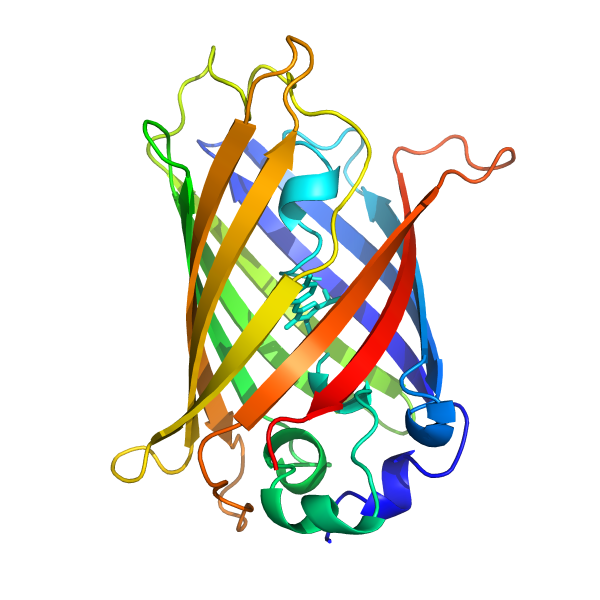

name: inverse
layout: true
class: center, middle, inverse
---
## Solvation Models

.subtitle[Implementation challenges, lessons learnt, best practices]

.author[Marco Caricato]

.institution[The University of Kansas]

.author[Roberto Di Remigio]

.institution[UiT - The Arctic University of Norway]

.footnote[[CC BY 4.0](https://creativecommons.org/licenses/by/4.0/) licensed.
Browse slides at [http://tinyurl.com/continuum-talking-points](http://tinyurl.com/continuum-talking-points)]

---
layout: false

## Software Development Is Essential to Quantum Chemistry

- Software architecture must allow fast development of new methods.
- Computer implementations must be reproducible.red[1]
- New modelling challenges require new (or improved) methods and new (or
  improved) software implementations.
- Software cannot be rewritten from scratch every time, we need to have
  **extensible** architectures
- Fast-paced development cycles can only occur within a clear software structure
- **Modularity**. Delimit capabilities, concerns, results.
- Reinventing the wheel is bad
- Build small, well-documented software components
- Reuse components in different contexts

.footnote-cite[.red[1] Hatton, L.; Warr, G. [arXiv [q-bio.QM]](https://arxiv.org/abs/1608.06897), (2016)]

---
layout: false
class: split-50-50
## Quantum/Classical __Polarizable__ Multiscale Models.red[1]

- Use **quantum** and **classical** physics together
  * quantum for chemically relevant subsystem
  * classical **and** polarizable for the environment

.column[

]
.column[

]
.footnote-cite[.red[1] Senn, H. M.; Thiel, W. _Angew. Chem. Int. Ed._ (2009), __48__, 1198]

???

- The idea of multiscale models is to _focus_ on the chemically relevant part
  of the system and treat the environment approximately.

---
layout: false

## Quantum/Classical __Polarizable__ Multiscale Models

- Discrete and continuum are similar
- Solution of a linear system of equations to obtain polarization
`$$
 \color{Green}{\mathbf{A}}\color{Red}{\mathbf{p}} = - \color{Green}{\mathbf{B}}\color{Blue}{\mathbf{s}}
$$`

1. What should be the boundary between classical and quantum software?
  - What should the quantum module take care of?
  - How to ensure extensibility?

1. Can we exploit the similarity?
  - What should the classical module take care of?
  - How should quantum and classical communicate?

2. What is needed to layer different methods for the environment?
  - How should different classical layers communicate?

3. Performance bottlenecks and how to overcome them.

---
layout: false

## Quantum Layer

1. Integrals
  - Interoperable formats for data transfer?
2. SCF procedure
  - Updates of the energy
  - Updates of the Fock matrix
3. Response calculations
4. Post-SCF methods

---
layout: false

## Continuum layer

1. Generating the cavity
  - Reading the geometry
  - Identifying functional groups
  - Discretization
  - Is there an interoperable format to transfer cavity information?

2. Classical solver
  - Environment representations, _i.e._ Green’s functions
  - Operator representations, _i.e._ collocation _vs_ Galerkin _vs_ domain decomposition
  - Linear system solver

3. Time-domain strategies
  -

---
layout: false

## Variational Formulation of the PCM.red[5]

Find \\(\color{Red}{\sigma(\mathbf{s})}\\) minimizing
`$$
U_\mathrm{PCM}[\color{Red}{\sigma(\mathbf{s})}]
=\frac{1}{2}\int_{\partial C} \mathop{}\!\mathrm{d}\mathbf{s} \color{Red}{\sigma(\mathbf{s})} \color{Green}{[\mathcal{R}^{-1}\mathcal{T}]} \color{Red}{\sigma(\mathbf{s})}
+\int_{\partial C} \mathop{}\!\mathrm{d}\mathbf{s} \color{Blue}{\varphi(\mathbf{s})}\color{Red}{\sigma(\mathbf{s})}
$$`

1. Physically meaningful
   - Unfavourable self-interaction of \\(\color{Red}{\sigma(\mathbf{s})}\\)
   - Favourable interaction of \\(\color{Red}{\sigma(\mathbf{s})}\\) and  \\(\color{Blue}{\varphi(\mathbf{s})}\\)

2. Equilibrium values are energies
3. Convexity

.footnote-cite[.red[5] Lipparini, F.; Scalmani, G.; Mennucci, B.; Cancès, E.; Caricato, M.; Frisch, M. J. _J. Chem. Phys._ (2010), __133__, 014106]

???

---
layout: false

## The Importance of Being Variational.red[6]

1. Avoids nonlinear couplings in the QM Hamiltonian
2. _Classical_ Hellmann-Feynman theorem
`$$
\frac{\mathop{}\!\mathrm{d}U_\mathrm{pol}}{\mathop{}\!\mathrm{d} F} =
\frac{\partial U_\mathrm{pol}}{\partial F}
+\cancelto{0}{\frac{\partial U_\mathrm{pol}}{\partial \color{Red}{\mathrm{p}}}\frac{\partial \color{Red}{\mathrm{p}}}{\partial F}}
$$`
3. **Valid for polarizable MM models**
4. Extended Lagrangian dynamics

.footnote-cite[.red[6] Lipparini, F.; Lagardère, L.; Raynaud, C.; Stamm, B.; Cancès, E.; Mennucci, B.; Schnieders, M.; Ren, P.; Maday, Y.; Piquemal, J.-P.
_J. Chem. Theory Comput._ (2015), __11__, 623]

???

Classical polarization energy of mixed discrete-continuum system.
`$$
U_\mathrm{pol}[\mathrm{p}] = \frac{1}{2}\mathrm{p}\color{Green}{\mathbb{V}}\mathrm{p} + \mathrm{p}\mathrm{s}
$$`
- p is the polarization degree of freedom
- s is the source term
- V is the classical interaction operator
- \\(\mathrm{p}\\) is an _independent_ degree of freedom
- _linear_ QM/classical coupling through

---
layout: false

## Self-Consistent Field with PCM

* .blue[Molecular electrostatic potential (MEP)]
  `$$
  \varphi(\mathbf{s}) = \sum_{\kappa\lambda}^{N_\mathrm{AO}} \color{Blue}{\varphi_{\kappa\lambda}(\mathbf{s})} D_{\lambda\kappa},
  \quad
  \color{Blue}{\varphi_{\kappa\lambda}(\mathbf{s}) }= \int\mathop{}\!\mathrm{d}\mathbf{r} \frac{-\chi^*_\kappa(\mathbf{r})\chi_\lambda(\mathbf{r}) }{|\mathbf{r} - \mathbf{s}|}
  $$`
* .red[Apparent surface charge (ASC)]
  `$$
   \color{Green}{\mathcal{T}}\color{Red}{\sigma(\mathbf{s})} = - \color{Green}{\mathcal{R}}\color{Blue}{\varphi(\mathbf{s})}
  $$`
* Fock matrix
  `$$
   f_{\kappa\lambda} =
   f^\mathrm{vac}_{\kappa\lambda} +
    (\color{Red}{\sigma(\mathbf{s})}, \color{Blue}{\varphi_{\kappa\lambda}(\mathbf{s})})_{
  \partial C}
  $$`

???

---

## A Checklist of Sorts for Application Programming Interfaces

_In computer programming, an __application programming interface__ (__API__) is
a set of subroutine definitions, protocols, and tools for building software and
applications._

### Encapsulation

- Hide internals by language or by convention
- Interface exposed in a separate file
- Expose the **what**, hide the **how**

### Development history

- Decouple the development history
- Each unit should have its own Git history/repository

.footnote-cite[Source: Wikipedia [Application programming interface](https://en.wikipedia.org/wiki/Application_programming_interface)]

---

## A Checklist of Sorts for Application Programming Interfaces, contd.

### Documentation

- Separate the **what it can do** from **how is it implemented**
- Documented **application programming interface** (API)
- Versioned API ([semantic](http://semver.org) or [sentimental](http://sentimentalversioning.org)
  or [romantic](https://github.com/jashkenas/backbone/issues/2888#issuecomment-29076249) versioning)

### Testing

- You don't want to find a bug in the Alps
- Sharpens interfaces
- Exposes coupling and cohesion

### Building and deploying

- Prerequisite for testable on its own
- Suitable distribution mechanisms

---
name: last-page
template: inverse

# Thanks for your attention!

Slideshow created using [remark] and served using [cicero]

Slides available on [GitHub](https://github.com/robertodr/continuum-talking-points)

Browse slides at [http://tinyurl.com/continuum-talking-points](http://tinyurl.com/continuum-talking-points)

[remark]: https://github.com/gnab/remark
[cicero]: https://github.com/bast/cicero
